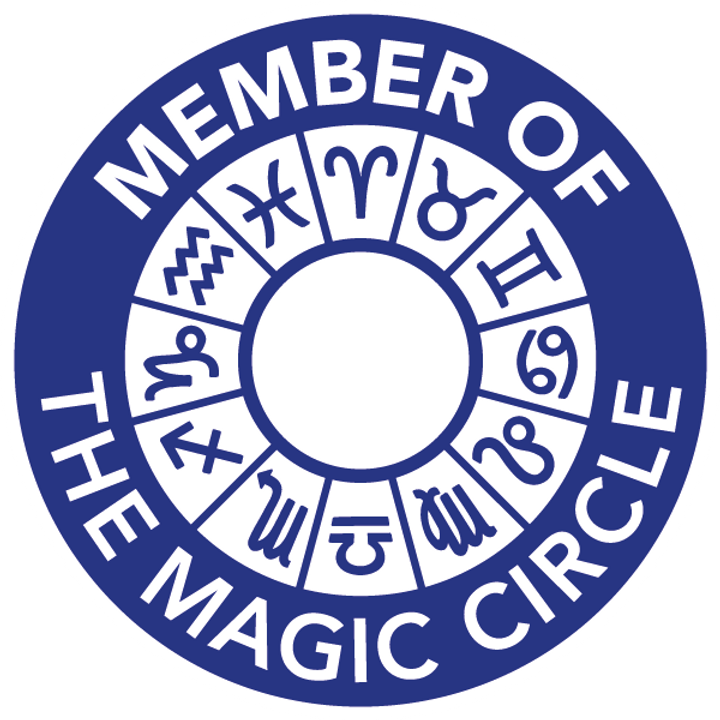
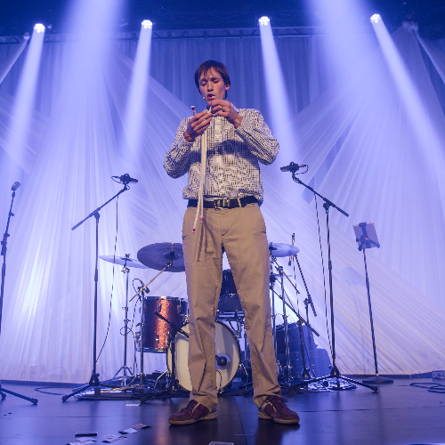

# 🪄🐝 Ed Brims 🐝🪄
##  The beekeeper-magician

 |  
:--------------------------------:|:--------------------------------------:
Ed does magic!                    |  Ed keeps bees!

In the 1770s, beekeeper Daniel Wildman presented an "Exhibition of the Bees on Horseback" around London. A swarm of bees followed him or his horseback assistant, forming themselves into a mask or a buzzing suit of armour. There are no pictures of the show, and after his run came to an end, bee magic was never again seen in London.

Until now!

Ed Brims is London's second ever beekeeper-magician. Here's a video of the sort of thing he does:

 Ed is a proud Member of the Magic Circle, the world's premier magic society.

[Get in touch](mailto:edbrims@gmail.com) and see Ed's bee magic for yourself!
