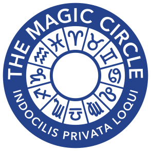
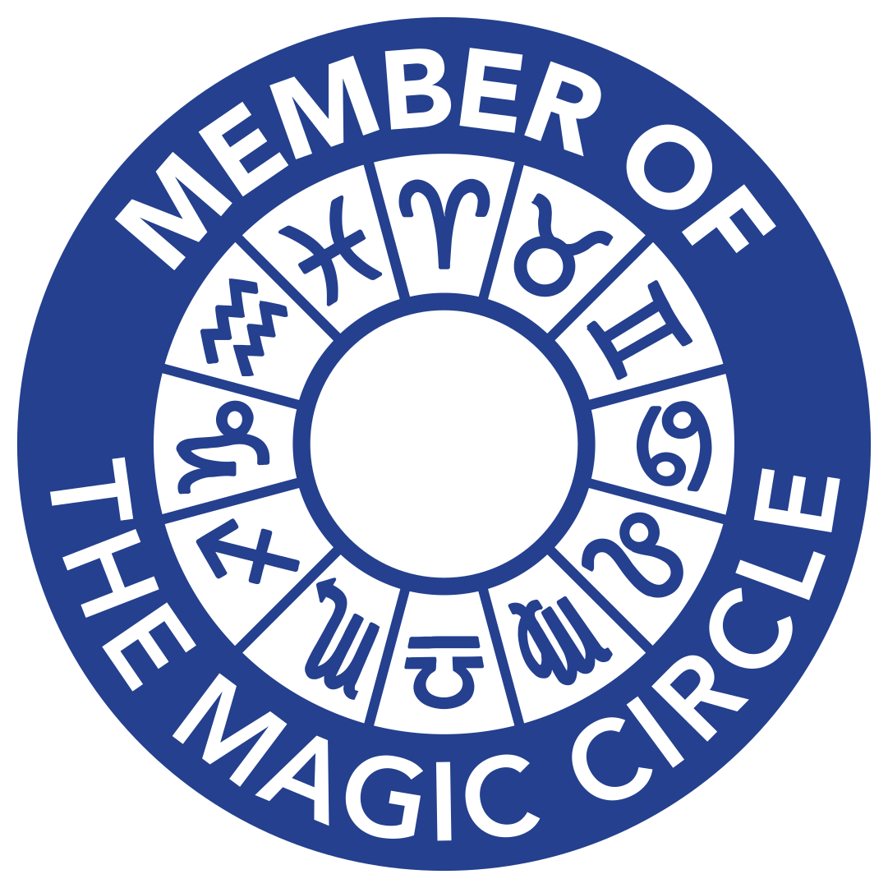

# 🪄🐝 Ed Brims 🐝🪄
##  The beekeeper-magician

 |  
:--------------------------------:|:--------------------------------------:
Ed does magic!                    |  Ed keeps bees!

In 1772 a stunt beekeeping double-act of Daniel Wildman and Patty Astley presented an "Exhibition of the Bees on Horseback" around London. A swarm of bees followed them around the arena, forming a mask or a buzzing suit of armour around them. After their show came to an end, bee magic was never again seen in London.

Until now!

Ed Brims presents London's second ever bee magic act. Here's a video of the sort of thing he does:

Ed is a Member of the Magic Circle, the world's premier magic society.

[Get in touch](mailto:edbrims@gmail.com) and see Ed's bee magic for yourself!
