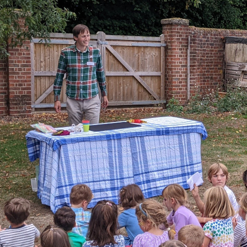
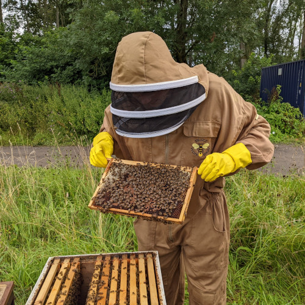

# 🪄🐝 Ed Brims - the beekeeper-magician 🐝🪄

 

I'm Ed Brims, and I perform magic with bees.

In the eighteenth century, beekeeper Daniel Widmann appeared at Astley's Amphitheatre with a trained swarm of bees. The bees followed his assistant as she rode a horse around the arena, forming itself into a buzzing suit of armour around her body. There are no pictures of the event, and after his run came to an end, bee magic was never again seen in London.

Until now!

