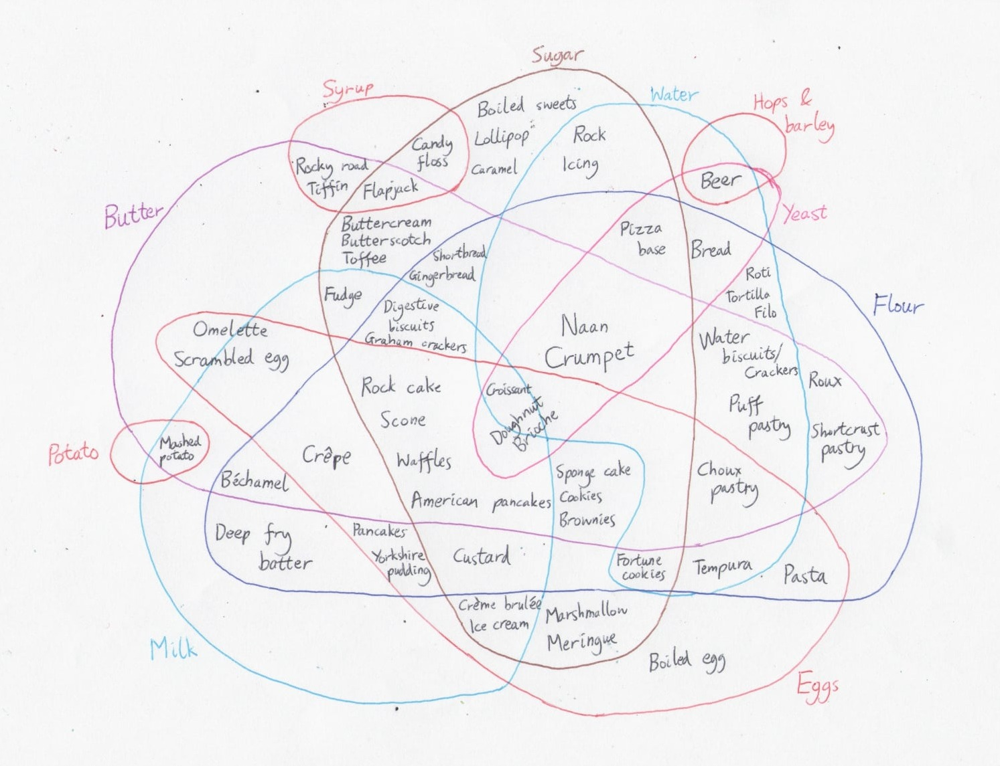

# The Venn diagram of baking

Behold: a Venn diagram of everything you can do with butter, flour, eggs, sugar, milk, water and yeast.

I have finally made sense of baking.

What have I missed? What have I got wrong? What incredible new food could be invented in the empty spaces?
