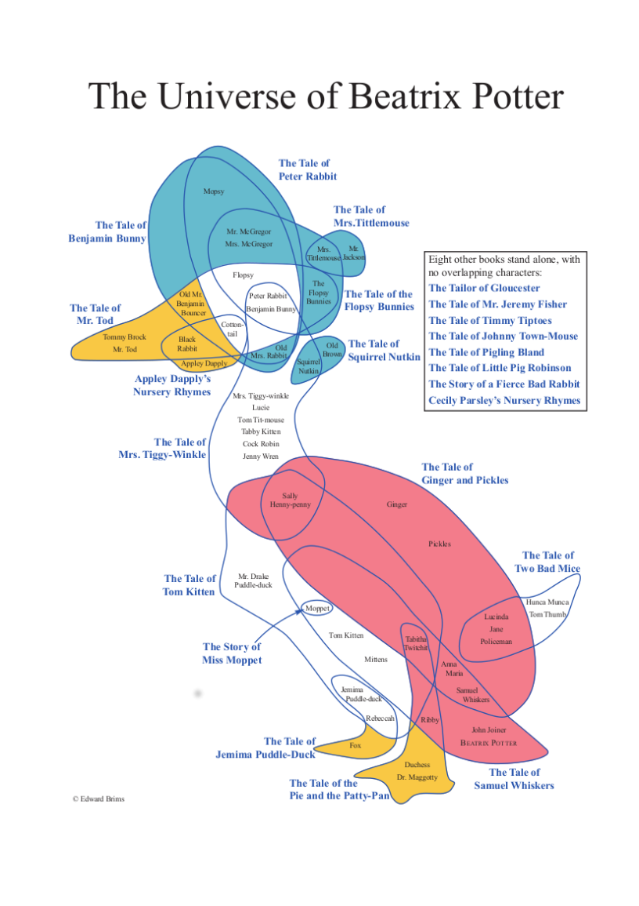
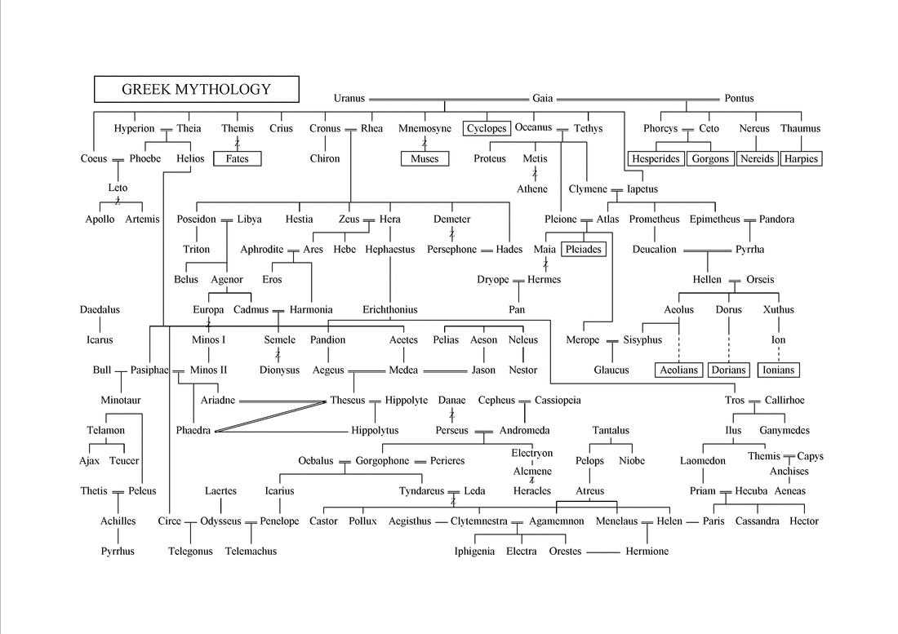
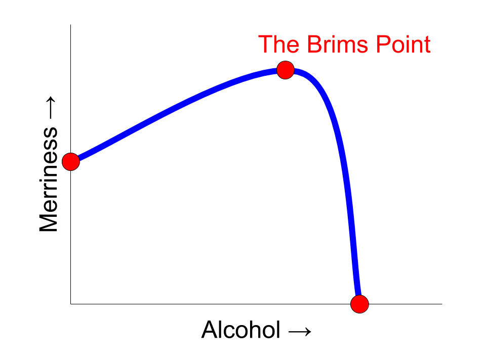

# Emsot
## Ed Makes Sense of Things

There have been moments over the last few decades when I haven't been thinking about magic or bees. In some of those moments, I have been trying to make sense of things that I don’t understand.

Sometimes I have drawn myself silly diagrams or made lists or created stop-motion animations to explain them to myself.

|                                                                 |                                                 |
|-----------------------------------------------------------------|-------------------------------------------------|
 | [The universe of Beatrix Potter](beatrix)       |
              | [My big fat Greek mythology family tree](greek) |
                  | [The Brims Point](point)                        |
